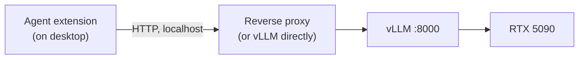
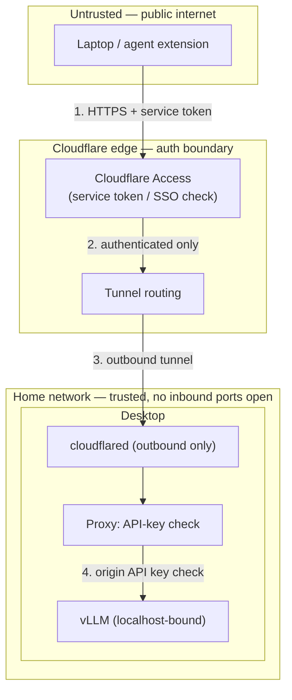
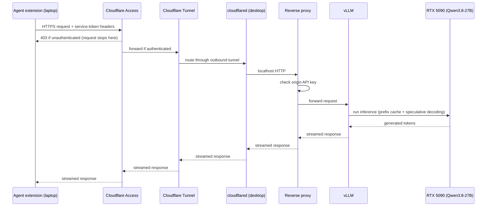

# Architecture — Private LLM Host

Companion to `PLAN.md` (phase-level roadmap/status) and `TASKS.md`
(granular task checklist). This file is the structural reference: hardware,
model, every component, what it runs on, how things connect, which
protocol/port/auth applies at each hop, and why each choice was made —
written so it can be sketched directly into a diagram.

Last updated: 2026-08-16

---

## 1. Hardware (desktop, home)

| Component | Spec |
|---|---|
| OS | Ubuntu |
| GPU | RTX 5090, 32GB VRAM (Blackwell generation) |
| CPU | AMD Ryzen 9 9950X3D |
| RAM | 96GB DDR5-6000 |
| Storage | 4TB PCIe 5 NVMe |

Headroom notes: 32GB VRAM comfortably fits the target model even at higher
precision (see §2). 96GB system RAM and 4TB NVMe are not bottlenecks for
this workload — the whole model lives in VRAM, system RAM just needs to
cover OS + serving process + agent tooling overhead.

## 2. Model — Qwen3.8-27B

Released 2026-08-13/14 (Apache 2.0). Key facts relevant to this build:

- **27–28B dense parameters**, hybrid attention: only 16 of 64 layers do
  full (quadratic) attention; the other 48 use a constant-size
  linear-attention state. This keeps KV cache size small even at very long
  context — good news for feeding an agent large repo context without
  exploding VRAM use.
- **262,144 token native context**, extensible to 1M via YaRN.
- Native vision-language model (multimodal) — **v1 of this project only
  uses the text/coding path**; vision is a possible stretch goal (e.g.
  screenshot-driven debugging) later.
- Ships with a built-in MTP (multi-token prediction) draft head — enables
  speculative decoding for faster generation, natively supported in vLLM.
- Benchmarks position it as strong specifically for coding/agentic work —
  e.g. Terminal-Bench and SWE-bench Pro scores competitive with much
  larger closed models. Good match for the intended use case.

**VRAM budget by precision** (weights only, before KV cache):

| Precision | Approx. size | Notes |
|---|---|---|
| BF16 | ~56GB | Doesn't fit on one 32GB card |
| FP8 | ~28GB | Fits, tight headroom for KV cache/context |
| NVFP4 | ~24.6GB | Blackwell-native 4-bit; official vLLM recipe validated on this exact GPU generation; leaves the most headroom for long context |
| GGUF (4-bit, llama.cpp path) | ~14–17GB | Not the current plan (see §3.1), noted as a fallback option |

**Recommended starting precision: NVFP4.** There's an official vLLM
deployment recipe for Qwen3.8-27B at NVFP4 specifically targeting Blackwell
GPUs, and it leaves the most VRAM free for large context windows, which
matters for a coding agent sending substantial file/repo context per turn.
FP8 is the fallback if NVFP4 tooling proves unstable (it's a newer/more
exotic quantization format; FP8 is more broadly battle-tested).

---

## 3. System diagram (full remote path)

```mermaid
flowchart TB
    subgraph LAPTOP["Laptop (anywhere, untrusted network)"]
        AGENT["Agent extension\n(Continue / Cline / Roo / OpenCode)\nin VS Code"]
    end

    subgraph EDGE["Cloudflare edge (public internet)"]
        ACCESS["Cloudflare Access\nZero Trust auth gate"]
        TUNNEL_EDGE["Cloudflare Tunnel edge"]
    end

    subgraph DESKTOP["Desktop — Ubuntu, home network (trusted)"]
        CLOUDFLARED["cloudflared\n(outbound-only tunnel daemon)"]
        PROXY["Reverse proxy — Caddy (tentative)\nTLS termination, API-key check, logging"]
        VLLM["vLLM server\n(systemd service, :8000)\nOpenAI-compatible API"]
        GPU["RTX 5090 32GB VRAM\nQwen3.8-27B resident (NVFP4)"]
    end

    AGENT -- "HTTPS request\n(Cloudflare Access service-token headers)" --> ACCESS
    ACCESS -- "reject if unauthenticated" -.-> AGENT
    ACCESS -- "authenticated request" --> TUNNEL_EDGE
    TUNNEL_EDGE -- "outbound tunnel\n(cloudflared-initiated, no inbound port)" --> CLOUDFLARED
    CLOUDFLARED -- "localhost HTTP" --> PROXY
    PROXY -- "API-key checked HTTP" --> VLLM
    VLLM <-- "inference" --> GPU
    VLLM -- "streamed response" --> PROXY --> CLOUDFLARED --> TUNNEL_EDGE --> ACCESS --> AGENT
```

Local-desktop shortcut: when working directly on the desktop, the agent
extension can point at `localhost:8000` (or the proxy port) directly,
bypassing Cloudflare Access/Tunnel entirely (steps 2–3 of the remote flow).



---

## 4. Component inventory

| # | Component | Technology | Runs on | Port(s) | Protocol | Exposure |
|---|---|---|---|---|---|---|
| 1 | Model weights + runtime | Qwen3.8-27B, NVFP4 quant | Desktop GPU (VRAM) | — | — | Not directly network-facing |
| 2 | Model serving layer | vLLM | Desktop, systemd service | `:8000` (internal) | HTTP, OpenAI-compatible (`/v1/chat/completions`, `/v1/completions`) | Bound to localhost/internal interface only |
| 3 | Reverse proxy (tentative) | Caddy | Desktop | e.g. `:443` internal or in front of `:8000` | HTTPS/HTTP | Sits between `cloudflared` and vLLM |
| 4 | Tunnel daemon | `cloudflared` | Desktop | none inbound (outbound-only) | Cloudflare Tunnel protocol (outbound) | No inbound firewall/router ports opened |
| 5 | Tunnel edge + hostname | Cloudflare Tunnel | Cloudflare's network | 443 (public) | HTTPS | Public-facing edge |
| 6 | Auth gate | Cloudflare Access (Zero Trust) | Cloudflare's network | — | Service-token headers (`CF-Access-Client-Id` / `CF-Access-Client-Secret`) for programmatic clients; SSO/OTP for interactive/browser use | Rejects unauthenticated traffic before it reaches the tunnel |
| 7 | Origin API key (defense-in-depth) | Checked at proxy or vLLM | Desktop | — | Bearer/API-key header | Second gate in case a service token leaks |
| 8 | DNS / domain | Subdomain on a Cloudflare-managed domain (e.g. `llm.yourdomain.com`) | Cloudflare | — | DNS | Public record, routes to tunnel |
| 9 | Client / agent extension | Continue / Cline / Roo Code / OpenCode (not yet chosen) | Laptop or desktop, inside VS Code | — | HTTPS (remote) or HTTP (local) | Configured with base URL + auth headers |
| 10 | Power/availability policy | Sleep disabled (v1 default); WoL considered later | Desktop OS | — | — | Desktop must be awake for the whole chain to work |

---

## 5. Component details

### 5.1 GPU + model (Qwen3.8-27B)
- Lives entirely in VRAM on the RTX 5090 once vLLM loads it — no reload per
  request.
- NVFP4 quantization (~24.6GB weights), leaving VRAM headroom for KV cache /
  long context. FP8 (~28GB) is the fallback quantization if NVFP4 proves
  unstable.
- Hybrid attention architecture (16 full-attention layers + 48
  linear-attention layers) keeps KV cache growth sub-quadratic — relevant
  to how much context headroom is actually available in practice.
- Built-in MTP draft head enables speculative decoding inside vLLM — a
  performance detail, not a separate component, but worth noting on a
  diagram as "vLLM + MTP" rather than plain vLLM.

### 5.2 vLLM (model serving layer)
- Single systemd service on the desktop. Starts on boot, restarts on
  crash, logs to journal.
- Serves an OpenAI-compatible HTTP API on an internal port (`:8000`
  placeholder).
- Must run with a tool-calling/function-calling parser matching Qwen3.8's
  chat template — this is what lets agent tool calls (file edit, terminal)
  round-trip correctly. Still to verify during build (Phase 1).
- Bound to localhost or an internal-only interface — it never talks to the
  internet directly. Everything external goes through the proxy/tunnel.
- Context length capped conservatively at launch (64K–128K, well under the
  262K/1M ceiling) to keep KV cache size predictable.

### 5.3 Reverse proxy (tentative — Caddy)
- Optional but recommended layer sitting between `cloudflared` and vLLM.
- Responsibilities: TLS/host handling, checking the origin API key
  (defense-in-depth alongside Cloudflare Access), request logging.
- Not yet locked in as a hard requirement — architecturally it's the
  natural place to put the "second auth check," so it's included here as
  the recommended shape even though the exact tool could change.

### 5.4 `cloudflared` (tunnel daemon)
- Runs on the desktop, opens an **outbound-only** connection to
  Cloudflare's edge. No inbound port forwarding on the home router — this
  is the key security property of the design (no attack surface exposed
  at the network perimeter).
- Hands authenticated, tunneled requests to the local proxy/vLLM.

### 5.5 Cloudflare Tunnel + Access (edge layer)
- A subdomain (e.g. `llm.yourdomain.com`) on a Cloudflare-managed domain
  maps through the tunnel to the desktop's local port.
- **Cloudflare Access** sits in front of the hostname and rejects
  unauthenticated requests at Cloudflare's edge — before they ever reach
  the home network.
- Two auth modes:
  - Interactive (browser) → SSO / email-OTP.
  - Programmatic (agent extensions) → **Access Service Token**
    (`CF-Access-Client-Id` + `CF-Access-Client-Secret` headers), configured
    directly in the agent extension's request headers.

### 5.6 Client / agent extension layer
- No custom extension is being built — an existing OpenAI-compatible-
  endpoint agent tool (Continue, Cline, Roo Code, or OpenCode; final pick
  still open) is pointed at the tunnel hostname.
- Configuration surface per client: base URL
  (`https://llm.yourdomain.com/v1` remote, or `http://localhost:8000/v1`
  local), model name, auth headers (service token + origin API key).
- Same config shape works from laptop and desktop; desktop can optionally
  shortcut straight to localhost.

### 5.7 Power/availability policy
- Not a network component, but an architectural dependency: every hop
  above requires the desktop to be powered on and `cloudflared`/vLLM
  running.
- v1 default: disable system sleep (display sleep only). Wake-on-LAN is a
  later option if idle power draw becomes a concern — would add a "WoL
  trigger" component (router support or an always-on LAN device) to this
  diagram if adopted.

---

## 6. Trust / security boundary diagram



Two independent auth checks before a request reaches the model: Cloudflare
Access at the edge (step 2), and the origin API key at the proxy (step 4).
Neither the router nor the desktop firewall has any inbound port open — the
only network-facing surface is Cloudflare's own edge.

---

## 7. Request sequence (remote case)



---

## 8. Key decisions log

| Decision | Choice | Rationale |
|---|---|---|
| Remote access | Cloudflare Tunnel + Access | Public HTTPS endpoint, SSO/service-token gate, no VPN client required on any device |
| Inference engine | vLLM | Official recipe for this model on Blackwell GPUs; prefix caching + speculative decoding fit the agentic workload well |
| Quantization | NVFP4 (fallback: FP8) | Blackwell-native, most VRAM headroom for long context |
| Client tooling | Existing OpenAI-compatible agent extensions (Continue/Cline/Roo/OpenCode) | Avoids building a custom VS Code extension; these already do what's needed |
| Power management | Disable sleep (v1 default) | Simplest reliable option; revisit WoL if power draw matters |

---

## 9. Open architecture items

These affect the diagram but aren't locked yet — flag them when sketching
so the visual doesn't overstate certainty:

- **Reverse proxy tool/placement** — Caddy is the working assumption, not
  confirmed. Could also be skipped in a minimal v1 (API key checked
  directly in a small shim in front of vLLM, or vLLM's own auth if
  sufficient).
- **Agent extension choice** — Continue vs Cline vs Roo Code vs OpenCode
  still open; doesn't change the architecture shape, only the box label at
  component 9.
- **Power management approach** — sleep-disable (v1 default) vs
  Wake-on-LAN (adds a trigger-device component) — see §5.7.
- **Exact vLLM/proxy port numbers** — placeholders (`:8000`, `:443`)
  pending actual configuration during Phase 0.
- **Multi-model / model-swap support** — out of scope for v1; would add a
  routing/model-selection component in front of vLLM if adopted later.
